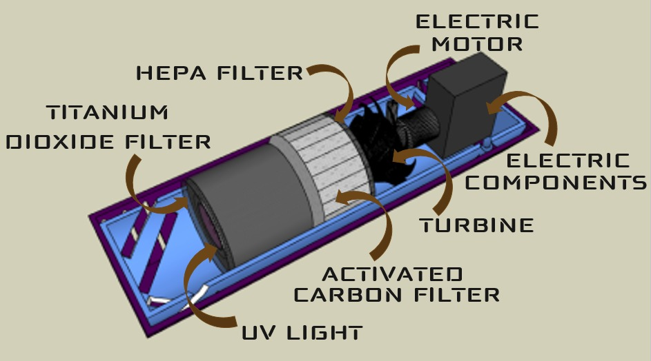
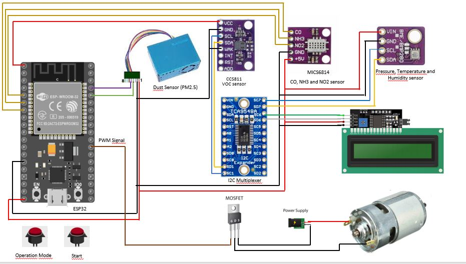
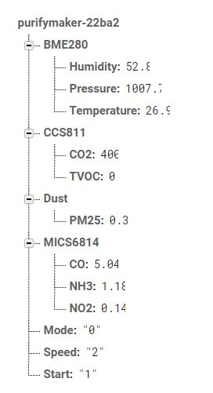

# New Air

# Overview

New Air allows purifying and at the same time measuring the level of air pollution present in the environment, alerting the user when the amount of gas exceeds a reference value. Our prototype using filters and photocatalytic processes, completely destroys COVID-19 viruses, microbes, bacteria, and other microorganisms. In addition, it effectively degrades Volatile Organic Compounds, such as formaldehyde, converting them into harmless substances such as carbon dioxide and water, and Particulate Matter, thus obtaining air free of contaminants. Air gives us our existence. Our goal is to establish early prevention of possible high levels of concentration of polluting harmful to humans.

# Circuit Diagram

Se usaron tales sensores y este es el esquematico del cableado.

# App

Se implementó una applicación

# Firebase Database

Se ordenó la base de datos de la siguiente manera

