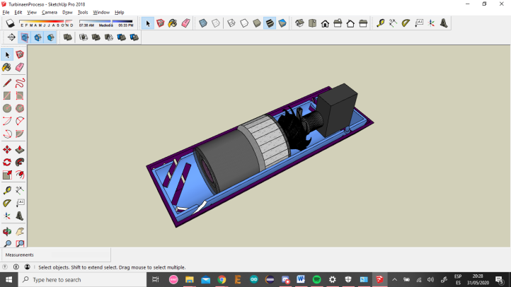

# New Air

New Air, un purificador de aire que produce una reacción catalítica liberando partículas reactivas, destruyendo el COVID-19 y otros patógenos. Además degrada otros contaminantes volviéndolos inofensivos. También  mide el nivel de contaminación del  ambiente, alerta si este es perjudicial y almacena datos en la nube.

Se usaron tales sensores y este es el esquematico del cableado.

