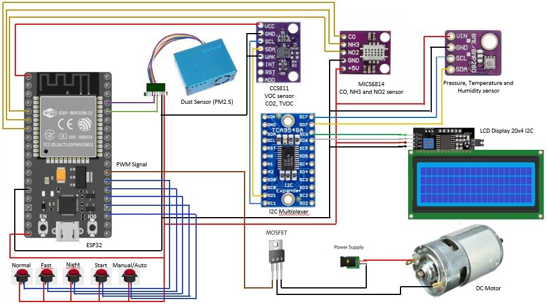

# New Air

# Overview

New Air allows purifying and at the same time measuring the level of air pollution present in the environment, alerting the user when the amount of gas exceeds a reference value. Our prototype using filters and photocatalytic processes, completely destroys COVID-19 viruses, microbes, bacteria, and other microorganisms. In addition, it effectively degrades Volatile Organic Compounds, such as formaldehyde, converting them into harmless substances such as carbon dioxide and water, and Particulate Matter, thus obtaining air free of contaminants. Air gives us our existence. Our goal is to establish early prevention of possible high levels of concentration of polluting harmful to humans.

# Circuit Diagram

The sensors included in this project are a PM2.5, which measure dust concentration; a CCS811, which is a VOC (Volatile Organic Compounds) sensor and detects CO2 and TVOC; a MCIS6814, which detects CO, NH3, and NO2; and a BME280, which detects pressure, temperature and humidity values from the environment. For the data processing, we are using an ESP32, which includes a Wifi and Bluetooth module, technologies that we are integrating with a mobile app in order to monitor the sensed data remotely. The LCD will display the data sensored and information such as speed modes and if the purifier is in manual or automatic mode.

# App

We managed to implement a functional prototype app using AppInventor (blocks programming), where we could fully control our air purifier and monitor the sensed data communicating with the database, which has been created using Firebase. While at the moment the app only shows values sensed, we can also implement graphics to visualize how the values change through time, including GPS data, which will turn our monitor system into a more powerful asset.

# Firebase Database

Se ordenó la base de datos de la siguiente manera

